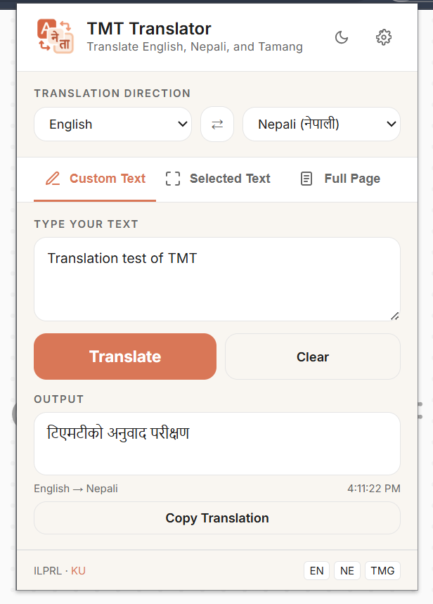
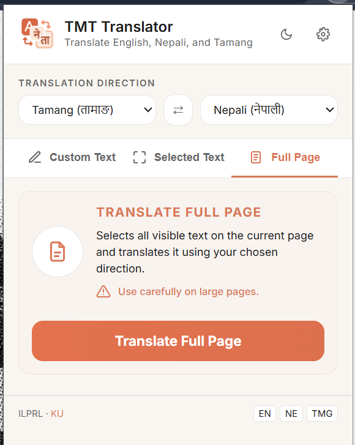
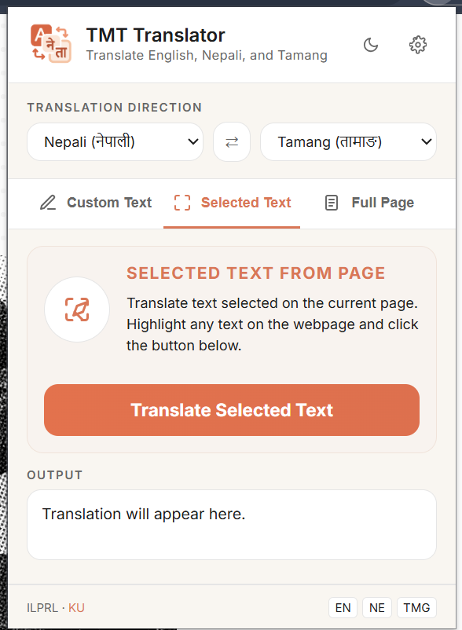
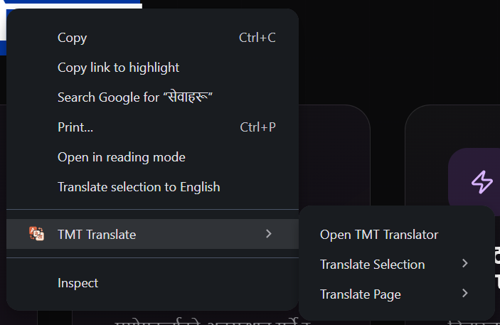

#  TMT Translator — Chrome/Firefox Extension
### Google TMT Hackathon 2026 | Track 01

---

## Table of Contents

- [Project Structure](#project-structure)
- [Screenshots](#screenshots)
- [Installation](#installation)
- [First-Time Setup](#first-time-setup)
- [Features](#features)
- [API Notes](#api-notes)
- [Security](#security)
- [Supported Translation Directions](#supported-translation-directions)
- [Roadmap](#roadmap)
- [Development](#development)

---

## Project Structure

```
tmt-extension/
├── manifest.json     ← Extension config (Manifest V3)
├── popup.html        ← Extension popup UI
├── popup.js          ← Popup logic & API calls
├── content.js        ← Injected into web pages (page translation)
├── content.css       ← Styles injected into pages
├── background.js     ← Service worker (right-click context menu)
└── icons/
    ├── icon16.png
    ├── icon48.png
    ├──  icon128.png
    ├── ku_logo.png
    ├── tmt_logo_colored.png
    └── tmt_logo.png
```

---

## Screenshots

### Feature 1: Manual Text Translation & Language Swap


### Feature 2: Full Page Translation


### Feature 3: Text-Selection Translation


### Context Menu Options


---

## Installation

To install and run the TMT Translator Extension, follow these steps

```
git clone https://github.com\SafalNarshing\TMT-Hackathon
```

### Step 2: Load in Chrome (Developer mode should be turned on first)
1. Open Chrome and go to: `chrome://extensions`
2. Enable **Developer mode** (top-right toggle)
3. Click **Load unpacked**
4. Select the `tmt-extension/` folder from the cloned repository
5. The TMT Translator icon will appear in your toolbar

### OR 

### Step 3: How to Load in Firefox

1. Go to: `about:debugging#/runtime/this-firefox`
2. Click **Load Temporary Add-on**
3. Navigate to `tmt-extension/` folder and select the `manifest.json` file

---

## First-Time Setup

1. Click the TMT Translator icon in your browser toolbar
2. Enter your team API key: `team_xxxxxxxxxxxxxxxx`
3. Click **Save** — the key is stored securely using `chrome.storage.local`
4. Select your source and target language
5. Start translating!

---

## Features

| Feature | How |
|---|---|
| **Manual text translation** | Type/paste in popup, click Translate |
| **Full page translation** | Click "Translate Page" in popup |
| **Right-click translation** | Select text → Right-click → "Translate Selected Text" → choose language |
| **Open translator** | Right-click on page → "Open TMT Translator" to open popup |
| **Translate current page** | Right-click on page → "Open TMT Translator" → "Translate current page" → choose language |
| **Language swap** | Click ⇄ button |
| **Copy output** | Click "Copy Translation" after translating |

---

## API Notes

- Base URL: `https://tmt.ilprl.ku.edu.np/lang-translate`
- Language codes: `en`, `ne`, `tmg`
- API works **sentence by sentence** — content.js splits text accordingly
- Rate limiting: 150ms delay between sentences for large pages
- Always check `message_type` field — HTTP status is always 200

---

## Security

- API key stored in `chrome.storage.local` — never exposed in code
- Never commit your real API key to GitHub
- Use environment variables or the extension's own secure storage

---

## Supported Translation Directions

- English → Nepali
- English → Tamang
- Nepali → English
- Nepali → Tamang
- Tamang → English
- Tamang → Nepali

---

## Roadmap

Full-page translation currently has partial coverage on traditional server-rendered sites (e.g. Onlinekhabar, Nepali Wikipedia) due to deeply nested, table-heavy, and opacity-hidden DOM structures.

**Planned improvements:**

- **Block-level translation** — walk up to the nearest block ancestor (`<p>`, `<li>`, `<td>`) and translate its full text as one unit instead of individual fragmented text nodes
- **IntersectionObserver re-scan** — trigger a re-scan when content scrolls into view, replacing the current timed fallback passes for lazy-loaded card sections
- **Layout-based visibility** — use `getBoundingClientRect()` to detect elements with real layout regardless of `opacity` or `transform`, catching carousel and drawer content that CSS-hides without `display: none`
- **Devanagari-aware thresholds** — apply a shorter minimum-length filter for Devanagari script specifically, since a 2-character Nepali word can carry full meaning
- **Stable node cache** — tag translated nodes with a `data-tmt-id` key so re-scan passes skip them instantly without relying solely on `.tmt-wrap` ancestor checks

If you expect to develop locally, use the `Load unpacked` flow (Chrome) or `Load Temporary Add-on` (Firefox) to test changes while iterating.

## Development

- Run-time: Chrome/Chromium and Firefox (temporary add-on) are supported for local testing.
- Manifest: This extension uses Manifest V3; `background.js` acts as the service worker.
- To iterate on UI/logic: edit `popup.html`, `popup.js`, `content.js`, then reload the extension in the browser.
<!-- 
## Contributing

- File an issue or open a PR against `main` with a short description of the change.
- Don't commit real API keys. Use placeholder keys and document how to obtain real keys in issues or internal docs.

Thank you for checking out TMT Translator — contributions welcome! -->
